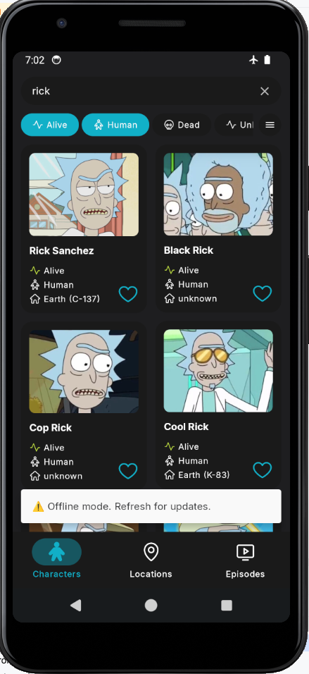

  

A modern Android application for exploring the Rick and Morty universe, built with Jetpack Compose and cutting-edge Android technologies. API https://rickandmortyapi.com/

	

## Features

🚀 Core Features
- Browse characters, locations, and episodes from the Rick and Morty universe
- Fully interactive design: users can tap on any filter, item, or detail to navigate to a dedicated screen with the selected parameter applied.
- Offline-first design with seamless caching
- Deep linking support for sharing content
- Predictive back gestures for smooth navigation
- Min SDK 21
 
🎨 UI/UX Highlights
- Dark/Light theme support
- Design System (based on: https://www.figma.com/community/file/1225458908057208058)
- Full edge-to-edge support
- Beautiful shared element transitions between screens
- Collapsible app bars with custom scroll behaviors
- Adaptive layouts for different phone orientation
- Instagram-like tab navigation (clear backstack on first click, scroll to top on second, refresh on third)
- Shimmer effects and loading placeholders
- Hide keyboard when click or scroll screen
- Splash screen
- Pull to refresh

⚙️ Technical Highlights
- MVI architecture with clean state management (based on: https://github.com/adidas/mvi)
- Modular design with feature, api, base modules
- Type-safe navigation system
- Multiple NavHosts: Nested navigation graphs (for bottom navigation and deeplinks)
- Pagination with custom Offline/Online PagingSources and RemoteMediators
- Usage of PageKeys which are stored locally to paginate and cache data basing on Filter parameter
- Comprehensive error handling and retry mechanisms

## Tech Stack

📱 Android Components
- 100% Kotlin with Coroutines & Flow
- Jetpack Compose with Material 3 for UI 
- ViewModel
- Navigation Compose with custom feature entries (with usage of NEW type-safe **non-reified** methods)
- Room for local database
- Paging 3 for pagination
- Dagger 2 for DI

🌐 Networking
- Retrofit for REST API
- Coil for image loading
- Chucker for HTTP inspection

🏗️ Architecture
- MVI (Model-View-Intent)
- Clean Architecture
- Modular design (api, base, feature layers)
- Type-safe navigation system

🛠️ Build System
- Gradle Version Catalogs
- KSP for compile-time processing
- Included build-logic for common build configurations
- Custom convention gradle precompiled script plugins

## Architecture Overview

<pre lang="markdown"> 
RnM
├── app/
└── sources/
    ├── api/
    │   ├── character_detail_api/
    │   ├── characters_list_api/
    │   ├── data_api/
    │   ├── database_api/
    │   ├── domain_api/
    │   ├── episode_detail_api/
    │   ├── episodes_list_api/
    │   ├── location_detail_api/
    │   ├── locations_list_api/
    │   ├── model/
    │   └── remote_api/
    ├── base/
    │   ├── core/
    │   ├── core_ui/
    │   ├── data/
    │   ├── database_room/
    │   ├── dependencies/
    │   ├── design_system/
    │   ├── domain/
    │   └── remote_retrofit/
    └── features/
        ├── character_detail/
        ├── characters_list/
        ├── episode_detail/
        ├── episodes_list/
        ├── location_detail/
        └── locations_list/  
 </pre>

